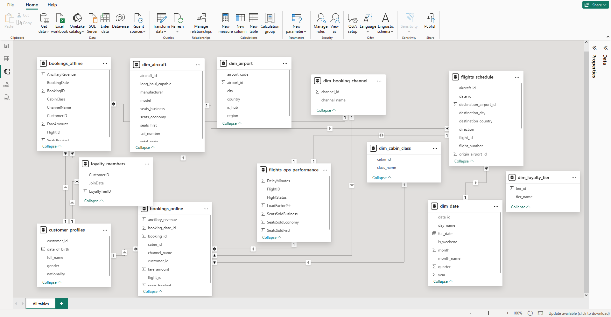
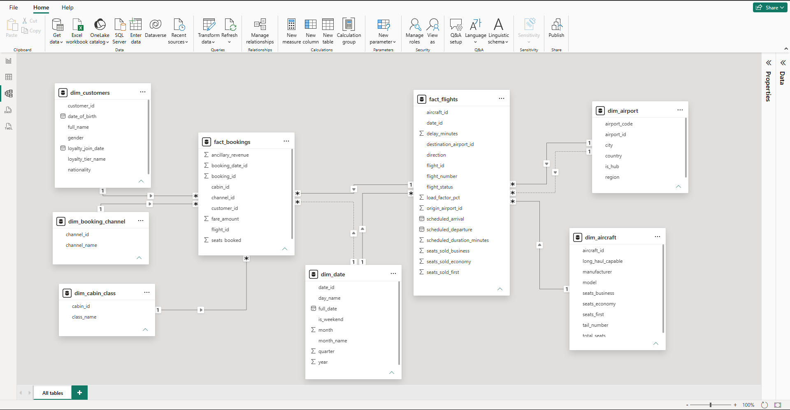
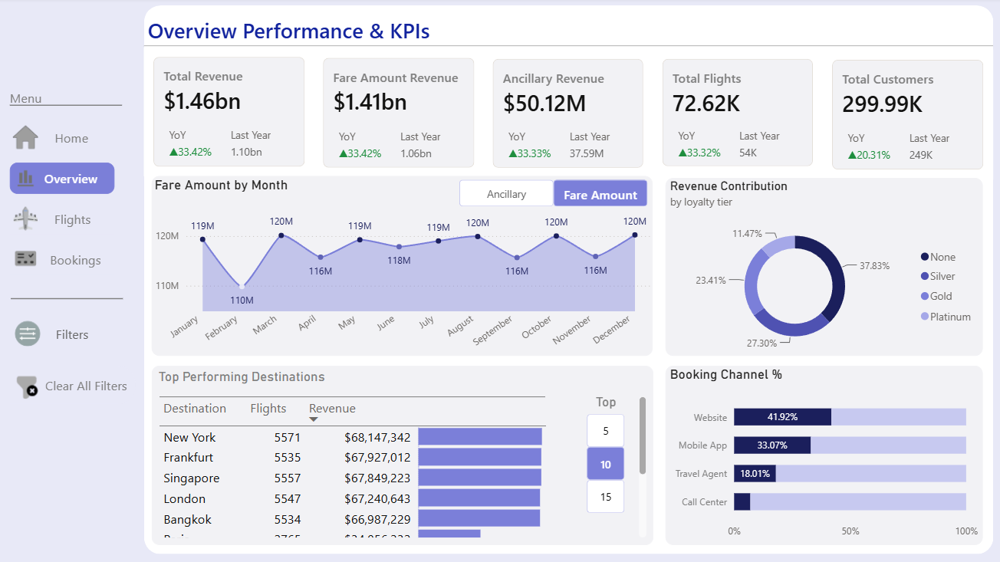
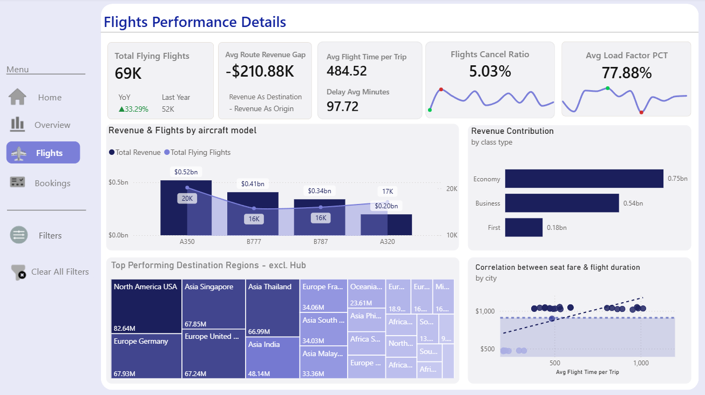
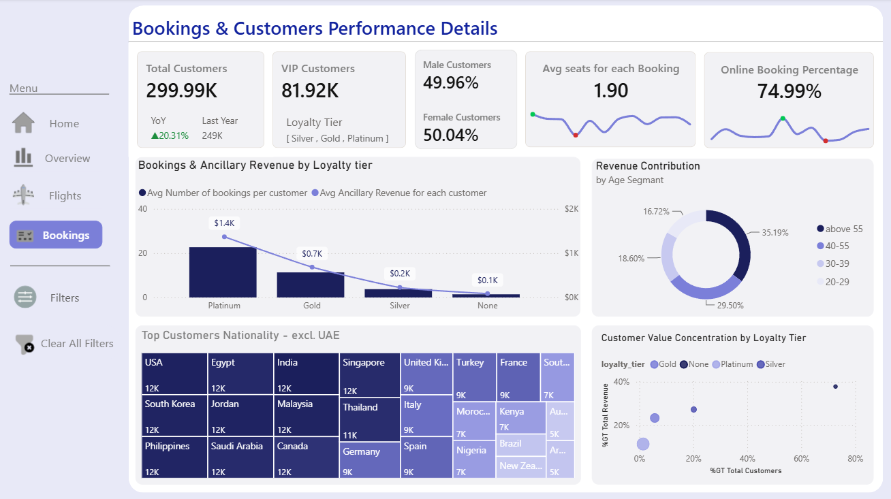

<div align="center">


<br><br>

# ✈️ Global Reach Airlines — Performance & Operational Analytics

### From four disconnected, messy source systems to a fully modeled, production-grade Power BI dashboard


</div>

---

<a name="about"></a>
## 📌 About This Project

**Global Reach Airlines** is a fictional mid-sized airline built to simulate four years (2022–2025) of real operations: a 27-destination network, a fleet of 34 aircraft, and roughly 300,000 customers. Every figure in this project is **entirely synthetic** — no real airline, individual, or transaction is represented.

What makes this project different from a typical portfolio dashboard is *where it starts*. Instead of beginning with a clean, ready-to-model table, this project begins exactly where a real BI analyst would: with data scattered across **six independent, uncoordinated source systems** — a CRM, a loyalty platform, a scheduling system, an ops monitoring tool, and two separate booking channels — each with its own naming conventions, date formats, and quality issues.

The project documents the full journey from that raw, fragmented starting point to a polished analytical product: **reconciling it in Power Query, modeling it into a proper analytical schema, layering advanced DAX on top, and designing an interactive dashboard around the insights it reveals.**

---

<a name="toc"></a>
## 📑 Table of Contents

1. [About This Project](#about)
2. [The Challenge: Fragmented, Messy Data](#challenge)
3. [Stage 1 — Power Query: Cleaning & Integration](#power-query)
4. [Stage 2 — Data Modeling: From Chaos to a Galaxy Schema](#modeling)
5. [Stage 3 — DAX: Measures & Parameters](#dax)
6. [Stage 4 — Dashboard Design & Visualization](#dashboard)
7. [Business Questions This Dashboard Answers](#business-questions)
8. [Advanced Techniques at a Glance](#advanced-techniques)
9. [Tech Stack & Skills Demonstrated](#tech-stack)
10. [Repository Structure](#repo-structure)
11. [Limitations & Assumptions](#limitations)
12. [How to Explore This Project](#explore)

---

<a name="challenge"></a>
## 🧩 The Challenge: Fragmented, Messy Data

Real airlines don't run on one clean database — they run on a patchwork of systems built by different vendors at different times, that were never designed to talk to each other. This project deliberately recreates that reality rather than skipping past it.

The raw data arrives as **12 separate extracts from 6 simulated systems**:

| System | What it exports | A sample of what's wrong with it |
|---|---|---|
| CRM | Customer profiles | — (clean baseline) |
| Loyalty Platform | Membership & tier data | PascalCase headers, `dd/mm/yyyy` dates, ~40 duplicate rows |
| Scheduling System | Flight schedule | Denormalized airport columns duplicated from the airport reference table |
| Ops Monitoring | Delay, status, load factor | Inconsistent status casing (`ON TIME` vs `Delayed` vs `CANCELLED`) |
| Online Booking (Website + App) | Booking transactions | Clean, but a separate schema from the offline channel |
| Offline Booking (Agent + Call Center) | Booking transactions | Dates as text, currency stored as `"$585.25"` strings, cabin/channel as free text instead of IDs, ~1% missing ancillary revenue |

Every one of these issues was intentionally engineered to mirror a real multi-system export — not injected randomly. The full data dictionary, including a system-by-system breakdown of every quality issue and how the systems overlap, is documented separately in **[`data/README.md`](data/README.md)**.

---

<a name="power-query"></a>
## 🔧 Stage 1 — Power Query: Cleaning & Integration

With 12 raw extracts on the table, the first job was building an ETL layer that reconciles them into the handful of tables the final model actually needs — `dim_customer`, `dim_aircraft`, `dim_airport`, `dim_cabin_class`, `dim_booking_channel`, `dim_date`, `fact_flights`, and `fact_bookings`.

**Key transformation work:**
- **Merging paired systems** — `customer_profiles` + `loyalty_members` into one customer dimension; `flights_schedule` + `flights_ops_performance` into one flight fact table.
- **Appending channel-split systems** — `bookings_online` and `bookings_offline` standardized to a common schema (data types, column names, cabin/channel resolved from text back to surrogate keys) and appended into a single `fact_bookings`.
- **Locale-aware date parsing** — `dd/mm/yyyy` strings converted correctly rather than risking a silent day/month swap.
- **Currency string cleanup** — `"$585.25"` converted to a proper numeric type.
- **Categorical standardization** — flight status values unified to a single casing convention before being used in any downstream logic.
- **Staging query architecture** — every raw extract lives in a `Source_Data` folder with **Load disabled**, so the unmodeled source data never enters the in-memory model. Dimension and fact queries reference these staging queries rather than duplicating them, keeping the query dependency chain traceable end to end.

---

<a name="modeling"></a>
## 🧱 Stage 2 — Data Modeling: From Chaos to a Galaxy Schema

<div align="center">
<table>
<tr>
<td width="50%" align="center"><b>Before — Power BI's auto-detected relationships</b><br><sub>on the raw, unshaped extracts</sub></td>
<td width="50%" align="center"><b>After — the finished analytical model</b></td>
</tr>
<tr>
<td></td>
<td></td>
</tr>
</table>
</div>

The finished model follows a **Galaxy (Fact Constellation) Schema**: two fact tables — `fact_flights` and `fact_bookings` — share conformed dimensions rather than referencing each other directly, keeping each fact table in a clean star shape of its own rather than snowflaking outward.

**Modeling decisions worth calling out:**
- `dim_date` and `dim_airport` each relate to `fact_flights` **twice** (flight date vs. booking date; origin vs. destination airport). Power BI can only auto-activate one relationship per pair — the second is intentionally left **inactive** and resolved explicitly in DAX with `USERELATIONSHIP()` wherever the analysis calls for it.
- All dimensions are fully denormalized on purpose — `dim_customer` carries loyalty tier name and join date directly, with no separate loyalty lookup table left in the model, avoiding unnecessary snowflaking.
- A dedicated `route_airport` column resolves "the other end of the route" for any flight, regardless of whether it's outbound or inbound from the hub — built with `LOOKUPVALUE()` specifically because it needed to be **independent of which relationship happens to be active**, something `RELATED()` cannot guarantee.

---

<a name="dax"></a>
## 🧮 Stage 3 — DAX: Measures & Parameters

With the model in place, the DAX layer turns raw columns into business answers — and goes beyond basic aggregations into patterns that solve real ambiguity in the data.

A few examples:
- **`Route Revenue Gap`** — uses `USERELATIONSHIP()` to compare a single airport's revenue when it's the destination vs. when it's the origin, exposing route-level imbalance that a simple `SUM` could never surface.
- **`Loyalty Tier Value Index`** — divides each tier's share of revenue by its share of the customer base, quantifying exactly how disproportionate a segment's value is (e.g. a tier representing 1.4% of customers driving over 11% of revenue).
- **Two parameter techniques, used for two different jobs** — a **Field Parameter** lets a chart switch *which measure* it displays (Fare vs. Ancillary revenue) with zero duplicated visuals, while a **disconnected `GENERATESERIES` parameter table** feeds a *numeric input* into a Top-N ranking measure. The two are not interchangeable, and the project uses each only where it fits.

📄 The complete measure catalog — every formula with its explanation, plus a full breakdown of both parameter techniques — is documented in **[`docs/measures_documentation.md`](docs/measures_documentation.md)**.

---

<a name="dashboard"></a>
## 📊 Stage 4 — Dashboard Design & Visualization

Four report pages, each built around a specific analytical lens, connected by a fully custom bookmark-driven navigation sidebar rather than Power BI's default page tabs.

### 🏠 Home


Brand identity and entry point, with button-driven navigation to every report page.

### 📈 Overview — Performance & KPIs


Company-wide KPIs (Total Revenue, Fare vs. Ancillary split, Total Flights, Total Customers) with year-over-year comparisons, a Field-Parameter-driven revenue trend chart, loyalty tier revenue contribution, and booking channel mix.

### ✈️ Flights — Performance Details


Operational deep-dive: revenue and flight volume by aircraft model, cabin class contribution, regional performance, a fare-vs-duration correlation analysis, and the custom **Average Route Revenue Gap** KPI.

### 🧑‍🤝‍🧑 Bookings & Customers — Performance Details


Customer-centric view: loyalty tier segmentation, booking behavior by tier, nationality mix, and a **Customer Value Concentration** scatter plot that visualizes the Loyalty Tier Value Index directly.

**Design principles followed throughout:**
- A custom, accessibility-conscious Power BI theme applied consistently across every page.
- KPI cards paired with sparklines and YoY indicators, driven by dedicated `_Style Measures`, kept fully separate from the analytical `_Measures` table.
- Every visual choice (donut vs. bar, scatter vs. table) matched to how many categories it needs to represent, not chosen for variety's sake.

---

<a name="business-questions"></a>
## ❓ Business Questions This Dashboard Answers

- Which loyalty tiers generate revenue disproportionate to their share of the customer base — and by how much?
- Is there a systematic revenue imbalance between outbound and inbound legs on the same route?
- Which aircraft models and cabin classes contribute the most to total revenue and flight volume?
- How does booking channel mix (Website, App, Travel Agent, Call Center) break down, and what share of bookings is fully digital?
- What is the relationship between flight duration and average fare across destinations?

---

<a name="advanced-techniques"></a>
## 🚀 Advanced Techniques at a Glance

| Technique | Where it's used | Why it matters |
|---|---|---|
| **`USERELATIONSHIP()` for dual-role dimensions** | `Route Revenue Gap` | Separates an airport's revenue as origin vs. destination using the model's inactive relationship on demand |
| **`LOOKUPVALUE()` independent of active relationships** | `route_airport` calculated column | Avoids a subtle bug where `RELATED()` silently follows only the active relationship and returns a plausible but wrong result |
| **Field Parameters** | `Revenue Source` table, Overview page toggle | Swaps which measure a visual displays without duplicating visuals or relying on bookmarks |
| **Disconnected `GENERATESERIES` parameter** | `TopN Selection`, Top Performing Destinations table | Classic What-If Parameter pattern powering a dynamic 5/10/15 row selector |
| **Staging query pattern (load disabled)** | `Source_Data` folder in Power Query | Keeps raw, unmodeled extracts out of the in-memory model entirely |
| **Explicitly named methodology in measure names** | `Average Fare per Seat (Booking-Level Avg)` | Documents which of two valid averaging methods is in use, rather than leaving it ambiguous in the code alone |

---

<a name="tech-stack"></a>
## 🛠️ Tech Stack & Skills Demonstrated

| Area | Tools / Techniques |
|---|---|
| **Data Cleaning & ETL** | Power Query — merge, append, locale-aware date parsing, currency string cleanup, categorical standardization, staging query pattern |
| **Data Modeling** | Star & Galaxy schema design, conformed dimensions, active/inactive relationships, degenerate dimensions |
| **DAX** | `CALCULATE`, `USERELATIONSHIP`, `LOOKUPVALUE`, `AVERAGEX`, `FILTER`, Field Parameters, disconnected parameter tables |
| **Visualization** | Custom theme design, bookmark-driven navigation, KPI cards with sparklines, scatter plots, treemaps, dynamic Top-N tables |
| **Documentation** | Source-system-level data dictionaries, before/after ERD comparisons, full DAX measure catalogs |

---

<a name="repo-structure"></a>
## 🗂️ Repository Structure

```
Power-BI_Modeling_Analysis_Project/
│
├── README.md                        ← you are here
│
├── dashboard/
│   ├── 1_Home_page.png
│   ├── 2_Overview_page.png
│   ├── 3_Flights_page.png
│   └── 4_Bookings_page.png
│
├── data/
│   ├── README.md                    ← raw data dictionary & source-system notes
│   └── *.csv                        ← raw, source-system-level extracts
│
├── docs/
│   ├── measures_documentation.md    ← full DAX measure catalog + parameter deep dive
│   ├── model_before_clean.png
│   └── model_after_clean.png
│
└── pbix file/
    └── Global_Reach_analysis.pbix
```

---

<a name="limitations"></a>
## ⚠️ Limitations & Assumptions

- **Revenue, not profit** — the dataset contains ticket and ancillary revenue only; no cost data (fuel, crew, maintenance) exists, so every financial KPI is explicitly framed as *revenue*, never *profit*.
- **Synthetic data** — all figures, names, and patterns are artificially generated and do not reflect any real airline's performance.
- **Operational vs. commercial divergence is intentional** — seat counts from the Ops system and the Booking system are not expected to reconcile exactly; this mirrors how real airlines run these systems independently, and the gap is treated as an analytical signal rather than an error to hide.

---

<a name="explore"></a>
## 🔍 How to Explore This Project

1. Clone the repository and open [`pbix file/Global_Reach_analysis.pbix`](<pbix%20file/Global_Reach_analysis.pbix>) in Power BI Desktop.
2. Read **[`data/README.md`](data/README.md)** first — it explains the source-system structure behind every Power Query step.
3. Check **[`docs/measures_documentation.md`](docs/measures_documentation.md)** for the full DAX catalog, including the Field Parameter and What-If Parameter deep dive.
4. Open the report and start from the **Home** page navigation.

---

<div align="center">

**Built as a portfolio project to demonstrate end-to-end Power BI capability — from raw, fragmented, multi-source data to a polished analytical product.**

</div>
